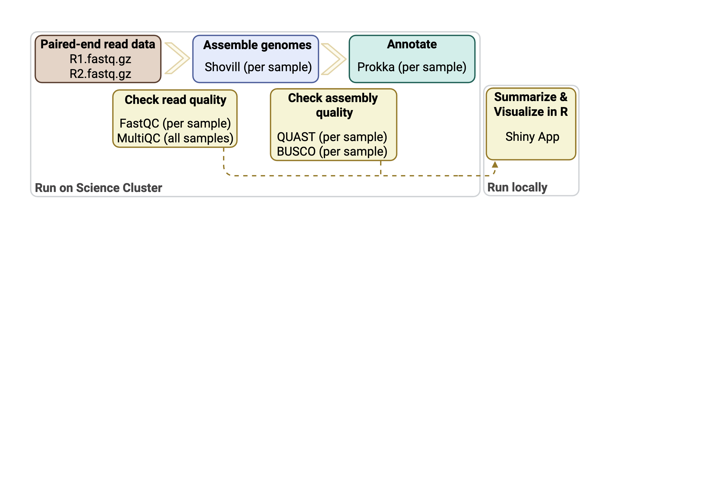

# WGS Pipeline (cluster run + local R metrics)

```text

There are two main parts of this pipeline:

Part 1 - cluster/: run the WGS pipeline on the cluster (Slurm + conda env)
Part 2 - local/:   summarize metrics + view dashboard locally (R)

Start here:
  01_wgs/cluster/README.md
  
Then:
  01_wgs/local/README.md
  
```

